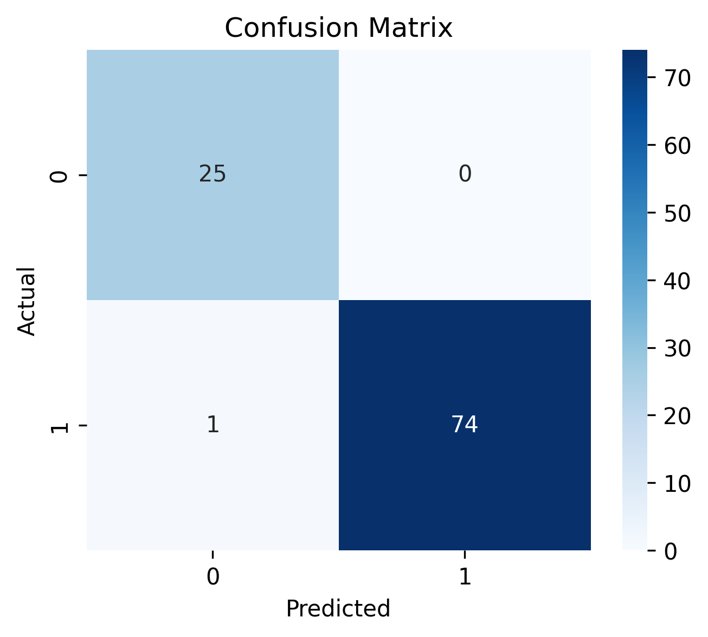
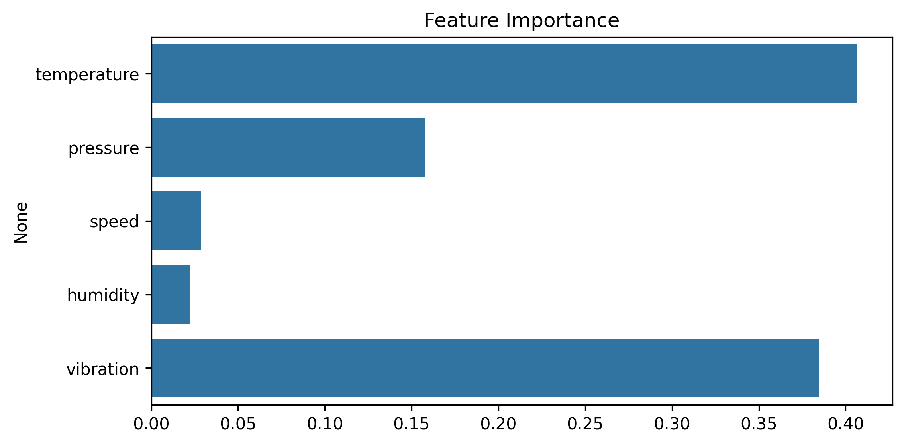

# Manufacturing Quality Prediction

## Problem
Predict product quality (PASS / FAIL) using manufacturing process parameters.

## Dataset
Synthetic manufacturing data simulating real production environments.

## Features
- Temperature
- Pressure
- Speed
- Humidity
- Vibration

## Model
- Random Forest Classifier

## Results
The model demonstrates strong performance in predicting product quality.
Feature importance analysis shows that temperature, pressure, and vibration
are key factors affecting quality.

## Model Evaluation

### Confusion Matrix

### Feature Importance

## Tools
Python, Pandas, Scikit-learn, Matplotlib, Seaborn

